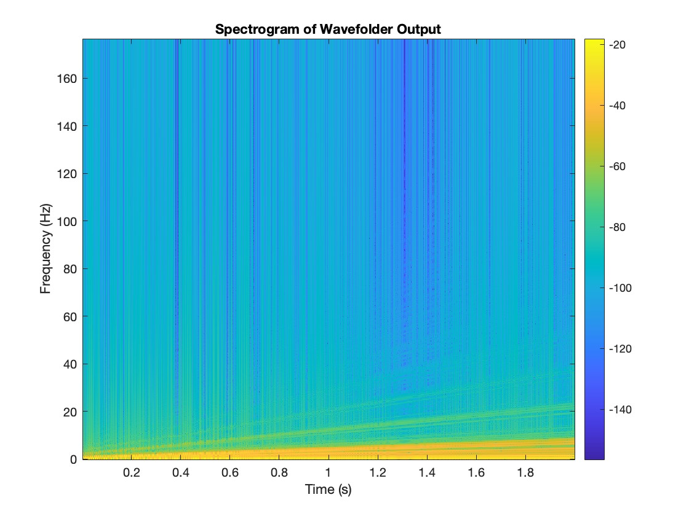

# Virtual Buchla 259 Wavefolder - Digital Modeling and DSP Implementation  

This project digitally models the **Buchla 259 Wavefolder**, a nonlinear waveshaping circuit used in **West Coast synthesis**. The implementation focuses on **real-time DSP processing** while mitigating aliasing artifacts using the **polyBLAMP (band-limited ramp) technique**.  

This work is based on **virtual analog modeling** principles and was developed in **MATLAB**.  

---

## Project Overview  

The **Buchla 259 Wavefolder** is an essential component of West Coast synthesis, known for its **nonlinear wavefolding** that introduces rich harmonic content. This project aims to:  

- **Digitally model** the Buchla 259 circuit while preserving its timbral characteristics  
- **Analyze the spectral response** and minimize aliasing artifacts  
- **Implement polyBLAMP** as an efficient anti-aliasing technique  
- **Evaluate the digital model** against theoretical benchmarks and analog simulations

---

## Features  
- MATLAB-based real-time signal processing
- Anti-aliasing using **polyBLAMP** (Polynomial Band-Limited Step)
- Nonlinear folding via memoryless functions
- Resistor-weighted voltage summation
- Spectral validation via FFT and spectrograms
- Designed for use in virtual modular synthesis and software synthesizers

---

## Techniques Used

- Memoryless nonlinear shaping functions based on the methodology of **Esqueda et al. (DAFx-17)**
- Resistor network emulation with precomputed scalar coefficients
- Fractional delay analysis for sample-accurate alias suppression
- Symmetrical inverse clipping
- Global signal summation with dynamic scaling

---

## Installation
1. **Clone the repository**:  
   ```bash
   git clone https://github.com/annaobara/Buchla-259-Wavefolder.git
   cd Buchla-259-Wavefolder

---

## Repository Structure

```
📁 docs/             → Final project report (PDF)
📁 src/              → MATLAB implementation files
📁 images/           → Output figures (spectrograms, waveform plots)
📁 tests/            → Example/test scripts
📁 examples/         → Audio demos
```

---

## 📊 Spectral Analysis

The model was tested with sinusoidal inputs. Results showed significantly reduced aliasing and preserved harmonic structures when compared to uncorrected models.

> 

---

## 🔧 Requirements

- MATLAB R2022b or later  
- Signal Processing Toolbox  

---

## 📄 License

Licensed under the MIT License. See [`LICENSE`](LICENSE) for details.

---

## 📚 Documentation

[Read full project report](docs/DSP_2024_fall.pdf)

---

## 🔗 Reference

Esqueda, F., Pöntynen, H., Välimäki, V., & Parker, J. D. (2017). *Virtual Analog Buchla 259 Wavefolder*. In **Proceedings of the 20th International Conference on Digital Audio Effects (DAFx-17)**.

---

Developed by [Anna Obara](https://github.com/annaobara) • Aalborg University, 2025

 
